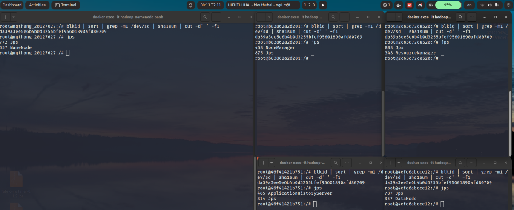

# Lab 01: A Gentle Introduction to Hadoop

## Setting up Single-node Hadoop Cluster
**Verify hadoop installation for each member of the group**

### `20127011` **Le Tan Dat**

### `20127458` **Dang Tien Dat** 


### `20127438` **Le Nguyen Nguyen Anh**


### `20127627` **Nguyen Quoc Thang**


## Introduction to MapReduce
**This a section we will answer the following questions:**
1. **How do the input keys-values, the intermediate keys-values, and the output keys-values relate?**
    **Answer**: In a MapReduce job, the input keys-value (represent the input data that needs to be processed) are processed by a map function to produce intermediate key-value pairs (the value represent the data that is associated with each key). These intermediate key-value pairs are then sorted by key and passed on to the reduce function, which groups the values associated with each intermediate key and produces the final output key-value pairs.

2. **How does MapReduce deal with node failures?**
    **Answer**: MapReduce handles the fault node in a fault tolerant manner. When a node fails during execution, the tasks running on the node are automatically rescheduled to run on other nodes in the cluster. There are 2 mechanisms in MapReduce to handle node errors including: Speculative Execution and Task Tracking as follow.
    - **Speculative Execution**: MapReduce can launch duplicate copies of a task on different nodes to ensure that at least one copy of the task completes successfully. If one of the nodes fails or is slow to complete its task, the duplicate copy can take over and complete the work.
    - **Task Tracking**: MapReduce tracks the progress of each task and can detect when a task is taking too long to complete. If a task is taking too long, MapReduce can launch a duplicate copy of the task on a different node. If the duplicate copy completes successfully, the original task is killed.

3. **What is the meaning and implication of locality? What does it use?**
    **Answer**: 
    - **Meaning of locality**: Locality in Hadoop refers to the ability to process data on the same node or machine where the data is stored, in order to avoid data transmission between nodes in the network.
    - **Implication of locality**: Locality is an important feature of Hadoop to optimize data processing performance by minimizing the time it takes to transmit data over the network.
    - **Used for**: Locality is used in Hadoop to optimize data processing performance by ensuring that data processing tasks are performed on the same node where the data is stored. This helps to minimize the time it takes to transmit data over the network and improve data processing performance in Hadoop. 

4. **Which problem is addressed by introducing a combiner function to the MapReduce model?**
    **Answer**: The introduction of a combiner function to the MapReduce model addresses the problem of excessive data shuffling and network traffic during the Reduce phase. The combiner function is used to reduce the amount of data that needs to be transferred between the Map and Reduce tasks in a MapReduce job. The combiner function is executed on the output of the Map task on each node before the data is transferred to the Reduce task. The combiner function is optional and is only used if it reduces the amount of data that needs to be transferred between the Map and Reduce tasks. 

## Running a warm-up problem: Word Count

- **Step 1**: 


- **Step 2**:


- **Step 3**:


## Bonus
### Extended Word Count: Unhealthy relationships
**After create file `Unhealthy_relationships.java` and `input.txt`**
- **File `input.txt`**:


- **After run `Unhealthy_relationships.java`**, we have the result:


### Setting up Fully Distributed Mode
#### Hadoop Cluster Setup in Non-Secure Mode

**This section includes the machine id image of each machine:**




#### Research about Security in Hadoop Set-up
This a section we will answer the following questions:

1. **Is your Hadoop secured? Give a short explanation if your answer is yes. Otherwise, give some examples of risks to your system.**

    **Answer**: Yes my Hadoop is secured. Because I have to use the password to access the Hadoop. If I don't use the password, I can't access the Hadoop. So, I think my Hadoop is secured.  Encryption protects the data stored in Hadoop by making it unreadable to anyone who does not have the decryption key.

    Some examples of risks to a Hadoop system include:
    - Unauthorized access: If a Hadoop system is not properly secured, it can be accessed by unauthorized users who can steal, modify, or delete data.

    - Data breaches: Hadoop systems that store sensitive information such as financial or personal data are at risk of data breaches. If data is not properly secured, it can be stolen by attackers and used for malicious purposes.

    - Malware and viruses: Hadoop systems can be vulnerable to malware and viruses that can infect the system and compromise its security.

    - Insider threats: Insiders with access to Hadoop systems can intentionally or unintentionally cause harm to the system by stealing or modifying data, or by introducing malware or viruses.
    
2. **From your perspective, which method is better when securing your HDFS: authentication, authorization, or encryption? Give an explanation about your choices.**

    **Answer**: I think the authentication is better than authorization and encryption. Because the authentication is the first step to access the Hadoop. If I don't have the authentication, I can't access the Hadoop. So, I think the authentication is better than authorization and encryption.
    From my perspective, it is not possible to say that one method is better than the other when securing HDFS, as all three methods play important and complementary roles in overall Hadoop security.
    Authentication is the process of verifying the identity of a user or application attempting to access the HDFS. Authentication ensures that only authorized users can access the system, and helps prevent unauthorized access and data breaches. Authorization ensures that users can only access the data and resources that they are authorized to use, and helps prevent unauthorized access and data breaches. Without proper authorization, users may be able to access data or resources that they should not have access to, leading to security vulnerabilities.

    Encryption is the process of converting data into a format that is unreadable to unauthorized users. Encryption ensures that data is protected, even if it is accessed by unauthorized users. Encryption is especially important for sensitive data that needs to be protected at rest or in transit.

    To secure HDFS, it is important to use all three methods - authentication, authorization, and encryption - in conjunction with each other. Proper authentication and authorization ensure that only authorized users can access data, while encryption ensures that the data is protected, even if it is accessed by unauthorized users.

Insert table example:

Server IP Address | Ports Open
------------------|----------------------------------------
192.168.1.1       | **TCP**: 21,22,25,80,443
192.168.1.2       | **TCP**: 22,55,90,8080,80
192.168.1.3       | **TCP**: 1433,3389\
**UDP**: 1434,161

Code example:

```python
print("Hello")
```

```bash
cat ~/.bashrc
```

Screenshot example:


\newpage

Screenshot example:


Reference examples:

Some text in which I cite an author.[^fn1]

More text. Another citation.[^fn2]

What is this? Yet _another_ citation?[^fn3]


## References
<!-- References without citing, this will be display as resources -->
- Three Cloudera version of WordCount problem:
    - https://docs.cloudera.com/documentation/other/tutorial/CDH5/topics-/ht_wordcount1.html
    - https://docs.cloudera.com/documentation/other/tutorial/CDH5/topics/ht_wordcount2.html
    - https://docs.cloudera.com/documentation/other/tutorial/CDH5/topics/ht_wordcount3.html
- Book: MapReduce Design Patterns [Donald Miner, Adam Shook, 2012]
- All of StackOverflow link related.
- Set up Hadoop Cluster 
    - https://www.linode.com/docs/guides/how-to-install-and-set-up-hadoop-cluster/
    - https://hadoop.apache.org/docs/current/hadoop-project-dist/hadoop-common/ClusterSetup.html

<!-- References with citing, this will be display as footnotes -->
[^fn1]: So Chris Krycho, "Not Exactly a Millennium," chriskrycho.com, July 2015, http://v4.chriskrycho.com/2015/not-exactly-a-millennium.html
(accessed July 25, 2015)

[^fn2]: Contra Krycho, 15, who has everything _quite_ wrong.

[^fn3]: ibid