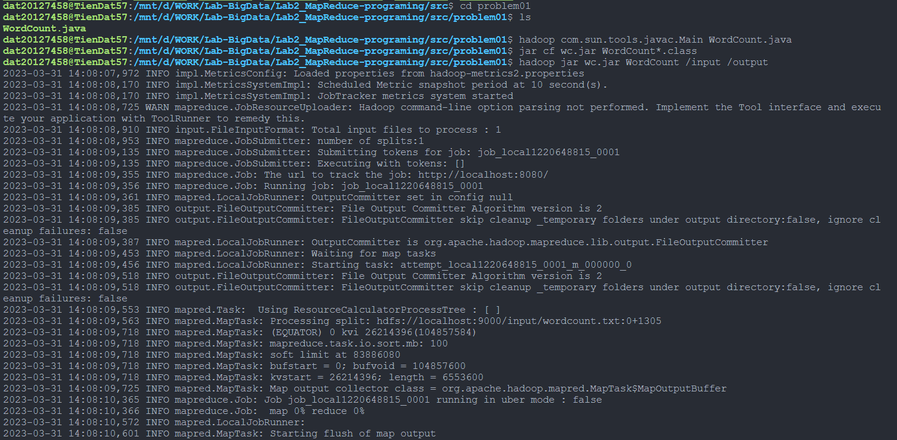
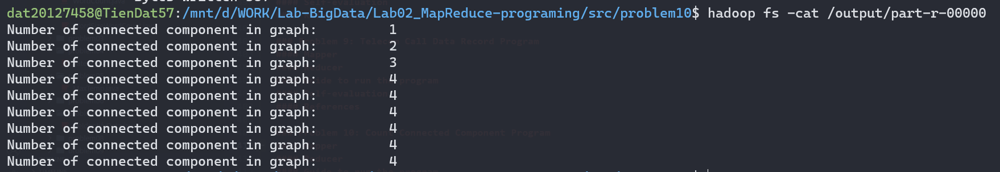

# Lab 02: MapReduce programming

## Work assignment

| Student ID | Full name | Work assignment |
|------------|-----------|-----------------|
| 20127011   | Le Tan Dat | Problem 1, 4, report |
| 20127438   | Le Nguyen Nguyen Anh | Problem 2, 6, 8 |
| 20127458   | Dang Tien Dat | Problem 3, 7, 10 report |
| 20127627   | Nguyen Quoc Thang | Problem 5, 9 |

-> Our team consulted the lab requirement file in drive lab 2, besides we also solved problems such as: 

## Explain the code in detail.
### Problem 1: WordCount
#### Mapper
```java
public static class WordCountMapper extends Mapper<Object, Text, Text, IntWritable>{
    private final static IntWritable number = new IntWritable(1);
    private Text word = new Text();
    public void map(Object key, Text value, Context context) throws IOException, InterruptedException {
        StringTokenizer token = new StringTokenizer(value.toString());
        while (token.hasMoreTokens()) {
            word.set(token.nextToken());
            context.write(word, number);
        }
    }
}
```
- The mapper class is a subclass of the Mapper class. 
- 2 variables are declared: 
    - `number` is a constant variable with value 1 to count the number of words.
    - `word` is a variable of type Text to store the word. 
- Idea of the mapper class: 
    - The mapper class will read the input file line by line. 
    - Then, the mapper class will split the line into words by using the `StringTokenizer` class. 
    - After that, the mapper class will loop through the words and write the word and the number 1 to the context.
    - The context will be used to write the output file.
  
#### Reducer
```java
public static class WordCountReducer extends Reducer<Text,IntWritable,Text,IntWritable> {
    private IntWritable result = new IntWritable();

    public void reduce(Text key, Iterable<IntWritable> values, Context context) throws IOException, InterruptedException {
        int sum = 0;
        for (IntWritable val : values) {
            sum += val.get();
        }
        result.set(sum);
        context.write(key, result);
    }
}
```
- The reducer class is a subclass of the Reducer class to reduce the output of the mapper class.
- 1 variable is declared: 
    - `result` is a variable of type IntWritable to store the number of words is counted.
- Idea of the reducer class: 
    - The reducer class will read the output file of the mapper class line by line. 
    - Then, the reducer class will split the line into words and the number of words by using the `StringTokenizer` class. 
    - After that, initialize the variable `sum` to 0. This variable is used to count the number of words. 
    - The reducer class will loop through the words and count the number of words by using the variable `sum`.
    - Finally, set the value of the variable `result` to `sum` and write the word and the number of words to the context.

#### Guide to run the program   
- Step 1: Create file `WordCount.java` in the folder `src` of the project.
  
- Step 2: Create file `wordcount.txt` in the folder `data` of the project and then `put` the file to the local HDFS by using the command 
  ```
  hdfs dfs -mkdir /input
  ```
  ```
  hdfs dfs -put data/wordcount.txt /input
  ```

  

- Step 3: Compile and run the program by using the command 
  - `javac` is a command-line tool that compiles Java source code into Java bytecode.
    ```
    hadoop com.sun.tools.javac.Main WordCount.java
    ```
  - `jar` is a command-line tool that creates a Java archive file (JAR) from a set of Java class files.
    ```
    jar cf wc.jar WordCount*.class
    ```
  - `hadoop` is a command-line tool that runs a MapReduce job.
      ```
      hadoop jar wc.jar WordCount /input /output
      ```

    

- Step 4: Check the result by using the command
    
    ```
    hdfs dfs -cat /output/part-r-00000
    ```

    

#### Self-evaluation
#### References

### Problem 2: WordSizeWordCount Program
#### Mapper
```java
public static class WordSizeWordCountMapper extends Mapper<Object, Text, IntWritable, Text> {
    public void map(Object key, Text value, Context context) throws IOException, InterruptedException {
        StringTokenizer itr = new StringTokenizer(value.toString());
        while (itr.hasMoreTokens()) {
            String curToken = itr.nextToken();
            IntWritable wordSize = new IntWritable(curToken.length());
            context.write(wordSize, new Text(curToken));
        }
    }
}
```
- The mapper class is a subclass of the Mapper class.
- Declared variables: 
    - `wordSize` is a variable of type IntWritable to store the length of the word.
    - `curToken` is a variable of type String to store the word.
    - `itr` is a variable of type StringTokenizer to split the line into words.
- Idea of the mapper class: 
    - The mapper class will read the input file line by line. 
    - Then, the mapper class will split the line into words by using the `StringTokenizer` class and save the words to the variable `itr`. 
    - After that, the mapper class will loop through the words and write the `length` of the word and the `word` to the context.
    - The context will be used to write the output file.

#### Combiner
```java
public static class Combiner extends Reducer<IntWritable,Text,IntWritable, Text> {
    private IntWritable result = new IntWritable(); 

    public void reduce(IntWritable key, Iterable<Text> values,Context context)
      throws IOException,InterruptedException {
      int sum = 0;

      for(Text x: values)
      {
          sum += 1;
      }

      result.set(sum);

      context.write(key, new Text(result.toString()));
    }
  }
```
- The `Combiner` class inherits from `Reducer` class. 
- Declared variables: 
    - `result` is a variable of type IntWritable to store the length of the word.
    - `sum` is a variable of type String to store the word.
- Idea of the combiner class: 
    - The combiner class will read the input file line by line. 
    - Then, the mapper class will split the line into words by using the `StringTokenizer` class and save the words to the variable `itr`. 
    - After that, the mapper class will loop through the words and write the `length` of the word and the `word` to the context.
    - The context will be used to write the output file.
    - CHƯA XONG
#### Reducer
```java
public static class WordSizeWordCountReducer extends Reducer<IntWritable, Text, IntWritable, IntWritable> {
    private IntWritable result = new IntWritable();
    public void reduce(IntWritable key, Iterable<Text> values, Context context) throws IOException, InterruptedException {
      int sum = 0;
      for (Text val : values) {
        sum += Integer.parseInt(val.toString());
      }
      result.set(sum);
      context.write(key, result);
    }
}
```
- The `WordSizeWordCountReducer` class is a subclass of the `Reducer` class to reduce the output of the mapper class.
- 1 variable is declared: 
    - `result` is a variable of type IntWritable to store the number of words is counted.
- Idea of the reducer class: 
    - The reducer class reads the output file of the mapper class line by line. 
    - Then, the reducer class will split the line into words and the number of words by using the `StringTokenizer` class. 
    - After that, initialize the variable `sum` to 0. This variable is used to count the number of words. 
    - The reducer class will using loop to traversal and count the number of the words with the same length accumulating in `sum`.
    - Finally, set the value of the value of `sum` to `result` and write the tuple <length, number of words>  to the context.

#### Guide to run the program
- Step 1: Create file WordSizeWordCount.java in the folder src of the project. 

- Step 2: Create file wordcount.txt in the folder data of the project and then put the file to the local HDFS by using the command.
  ```
  hdfs dfs -mkdir /input
  ```
  ```
  hdfs dfs -put data/wordcount.txt /input
  ```
- Step 3: Compile and run the program by using the command 
  - `javac` is a command-line tool that compiles Java source code into Java bytecode.
    ```
    hadoop com.sun.tools.javac.Main WordSizeWordCount.java
    ```
  - `jar` is a command-line tool that creates a Java archive file (JAR) from a set of Java class files.
    ```
    jar cf wc.jar WordSizeWordCount*.class
    ```
  - `hadoop` is a command-line tool that runs a MapReduce job.
      ```
      hadoop jar wc.jar WordSizeWordCount /input /output
      ```
- Step 4: Check the result by using the command
    ```
    hdfs dfs -cat /output/part-r-00000
    ```
#### Self-evaluation
#### References

### Problem 3: WeatherData Program
#### Mapper
```java
public static class MaxTemperatureMapper extends MapReduceBase implements Mapper<LongWritable, Text, Text, Text> {
    @Override
    public void map(LongWritable arg0, Text Value, OutputCollector<Text, Text> output, Reporter arg3) throws IOException {
        String line = Value.toString();
        String date = line.substring(6, 14);

        float temp_Max = Float.parseFloat(line.substring(39, 45).trim());
        float temp_Min = Float.parseFloat(line.substring(47, 53).trim());

        if (temp_Max > 40.0) {
        output.collect(new Text("Hot Day " + date),
                new Text(String.valueOf(temp_Max)));
        }
        if (temp_Min < 10) {
        output.collect(new Text("Cold Day " + date),
                new Text(String.valueOf(temp_Min)));
        }
    }
}
```
- The `MaxTemperatureMapper` class is a subclass of the `MapReduceBase` class which implements `Mapper` class.
- Declared variables: 
    - `line` is a variable of type String storing Value parameter.
    - `date` is a variable of type String extracting date information from the line.
    - `temp_Max` is a float variable splitting the line to take highest temperature value.
    - `temp_Min` is a float variable splitting the line to take lowest temperature value.
- Idea of the mapper class: 
    - The mapper class will read the input file line by line and each line is stored in `line` variable. 
    - Then, from date to highest and lowest temperature informations from each line will be splitted and stored. 
    - After that, consider to problem conditions and collect those cases into output.
    -                                   CHECK
#### Reducer
```java
public static class MaxTemperatureReducer extends MapReduceBase implements Reducer<Text, Text, Text, Text> {
      @Override
      public void reduce(Text Key, Iterator<Text> Values, OutputCollector<Text, Text> output, Reporter arg3) throws IOException {
        float max = Float.parseFloat(Values.next().toString());
        while (Values.hasNext()) {
            float temp = Float.parseFloat(Values.next().toString());
            if (temp > max) {
                max = temp;
            }
        }
        output.collect(Key, new Text(String.valueOf(max)));
      }
   }
```
- The `MaxTemperatureReducer` class extends to `MapReduceBase` class which implementing `Reducer` class.
- Declared variables: 
    - `max` is a float variable storing current Value parameter.
    - `temp` is a float variable storing temporary value for comparision.
- Idea of the mapper class: 
    - The mapper class will read the input file line by line and each line is stored in `line` variable. 
    - Then, create a current value while using loop to travesal and continue creating temporary value to compare aim to finding max value. 
    - Finally, collect found value into output.

#### Guide to run the program
- Step 1: Create file WeatherData.java in the folder src of the project. 

- Step 2: Create file weather_dât.txt in the folder data of the project and then put the file to the local HDFS by using the command.
  ```
  hdfs dfs -mkdir /input
  ```
  ```
  hdfs dfs -put data/weather_data.txt /input
  ```
- Step 3: Compile and run the program by using the command. 
  - `javac` is a command-line tool that compiles Java source code into Java bytecode.
    ```
    hadoop com.sun.tools.javac.Main WeatherData.java
    ```
  - `jar` is a command-line tool that creates a Java archive file (JAR) from a set of Java class files.
    ```
    jar cf wc.jar WeatherData*.class
    ```
  - `hadoop` is a command-line tool that runs a MapReduce job.
      ```
      hadoop jar wc.jar WeatherData /input /output
      ```
- Step 4: Check the result by using the command.
    ```
    hdfs dfs -cat /output/part-r-00000
    ```
#### Self-evaluation
#### References

### Problem 4: Patent Program
#### Mapper
```java
public static class Map extends Mapper<LongWritable, Text, Text, Text> {
    private Text _key = new Text();
    private Text _value = new Text();
    @Override
    public void map(LongWritable key, Text value, Context context) throws IOException, InterruptedException {
        String line = value.toString();
        StringTokenizer tokenizer = new StringTokenizer(line," ");
        while (tokenizer.hasMoreTokens()) {
            String jiten= tokenizer.nextToken();
            _key.set(jiten);
            String jiten1= tokenizer.nextToken();
            _value.set(jiten1);
            context.write(_key,_value);
        }
    }
}
```
- The `Map` class is a subclass of the `MapReduceBase` class which implements `Mapper` class.
- Declared variables: 
    - `_key` is a Text variable storing Value parameter.
    - `_value` is a Text variable storing Value parameter.
    - `line` is a float variable splitting the line to take highest temperature value.
    - `jiten` is a float variable splitting the line to take lowest temperature value.
    - `jiten1` is a float variable splitting the line to take lowest temperature value.
- Idea of the mapper class: 
    - The mapper class will read the input file line by line and each line is stored in `line` variable. 
    - Then, from date to highest and lowest temperature informations from each line will be splitted and stored. 
    - After that, consider to problem conditions and collect those cases into output.
    -                               CHECK
#### Reducer
```java
public static class Reduce extends Reducer<Text, Text, Text, IntWritable> {
    @Override
    public void reduce(Text key, Iterable<Text> values, Context context) throws IOException, InterruptedException {
        int sum = 0;
        for(Text x : values){
            sum++;
        }     
        context.write(key, new IntWritable(sum));
    }
}
```
#### Guide to run the program
- Step 1: Create file Patent.java in the folder src of the project. 

- Step 2: Create file patent.txt in the folder data of the project and then put the file to the local HDFS by using the command.
  ```
  hdfs dfs -mkdir /input
  ```
  ```
  hdfs dfs -put data/patent.txt /input
  ```
- Step 3: Compile and run the program by using the command. 
  - `javac` is a command-line tool that compiles Java source code into Java bytecode.
    ```
    hadoop com.sun.tools.javac.Main Patent.java
    ```
  - `jar` is a command-line tool that creates a Java archive file (JAR) from a set of Java class files.
    ```
    jar cf wc.jar Patent*.class
    ```
  - `hadoop` is a command-line tool that runs a MapReduce job.
      ```
      hadoop jar wc.jar Patent /input /output
      ```
- Step 4: Check the result by using the command.
    ```
    hdfs dfs -cat /output/part-r-00000
    ```
#### Self-evaluation
#### References

### Problem 5: MaxTemp Program
#### Mapper
```java
public static class MaxTempMapper
  extends Mapper<Object, Text, LongWritable, IntWritable> {
    public void map(Object key, Text value, Context context)
        throws IOException, InterruptedException {
        StringTokenizer itr = new StringTokenizer(value.toString());
        String year = itr.nextToken();
        String temp = itr.nextToken();
        context.write(new LongWritable(Integer.parseInt(year)), new IntWritable(Integer.parseInt(temp)));
    }
}
```
#### Reducer
```java
public static class MaxTempReducer extends Reducer<LongWritable, IntWritable, LongWritable, IntWritable> {
    private IntWritable result = new IntWritable();
    public void reduce(LongWritable key, Iterable<IntWritable> values, Context context)
      throws IOException, InterruptedException {
        int max = 0;
        for (IntWritable val : values) {
            if (val.get() > max) {
            max = val.get();
            }
        }

        // outputs will have format <year, maxTemp>
        result.set(max);
        context.write(key, result);
    }
}
```
#### Guide to run the program
#### Self-evaluation
#### References

### Problem 6: AverageSalary Program   
#### Mapper
#### Reducer
#### Guide to run the program
#### Self-evaluation
#### References

### Problem 7: De Identify HealthCare Program
#### Mapper
#### Reducer
#### Guide to run the program
#### Self-evaluation
#### References

### Problem 8: Music Track Program
#### Mapper
#### Reducer
#### Guide to run the program
#### Self-evaluation
#### References

### Problem 9: Telecom Call Data Record Program
#### Mapper
#### Reducer
#### Guide to run the program
#### Self-evaluation
#### References

### Problem 10: Count Connected Component Program
#### Mapper
```java
public static class CountConnectedMapper extends Mapper<Object, Text, IntWritable, IntWritable> {
    private IntWritable _vertex = new IntWritable();
    public void map(Object key, Text value, Context context) throws IOException, InterruptedException {
        StringTokenizer itr = new StringTokenizer(value.toString());
        _vertex.set(Integer.parseInt(itr.nextToken()));
        while (itr.hasMoreTokens()) {
            context.write(_vertex, new IntWritable(Integer.parseInt(itr.nextToken())));
        }
    }
}
```
- The `CountConnectedMapper` class is a subclass of the `MapReduceBase` class which implements `Mapper` class.
- Declared variables: 
    - `_vertex` is a IntWritable variable storing Value parameter.
- Idea of the mapper class: 
    - The mapper class will read the input file line by line and each line is stored in `itr` variable. 
    - Then, `_vertex` variable will be set to the first value of each line.
    - After that, loop through the rest of the line and write the value to the context.
  
#### Reducer
```java
public static class ComponentReducer extends Reducer<IntWritable, IntWritable, Text, IntWritable> {
    private IntWritable _result = new IntWritable();
    private Set<Integer> _visited = new HashSet<Integer>();
    private Stack<Integer> _stack = new Stack<Integer>();
    private int _count = 0;
    public void reduce(IntWritable key, Iterable<IntWritable> values, Context context) throws IOException, InterruptedException {
        if (!_visited.contains(key.get())) {
            _stack.push(key.get());
            while (!_stack.isEmpty()) {
                int v = _stack.pop();
                if (!_visited.contains(v)) {
                    _visited.add(v);
                    for (IntWritable val : values) {
                        _stack.push(val.get());
                    }
                }
            }
            _count++;
        }
        _result.set(_count);
        context.write(new Text("Number of connected component in graph: "), _result);
    }
}
```
- The `ComponentReducer` class is a subclass of the `MapReduceBase` class which implements `Reducer` class.
- Declared variables: 
    - `_result` is a IntWritable variable storing number of connected component in graph.
    - `_visited` is a Set variable storing visited vertex.
    - `_stack` is a Stack variable storing vertex.
    - `_count` is a int variable storing number of connected component in graph.
- Idea of the reducer class:
    - The reducer class will read the input file line by line and each line is stored in `values` variable.
    - Then, check if the vertex is visited or not. If not, push the vertex to the stack. 
    - After that, loop through the rest of the line and write the value to the context. 
    - After that, pop the vertex from the stack and check if the vertex is visited or not. If not, add the vertex to the visited set.
    - After that, loop through the rest of the line and write the value to the context.
    - After that, increase the count by 1.
    - Finally, increase the count by 1 and write the result to the context.
  
#### Guide to run the program
- Step 1: Create file CountConnected.java in the folder src of the project.
- Step 2: Create file graph.txt in the folder data of the project and then put the file to the local HDFS by using the command.
    ```
    hdfs dfs -mkdir /input
    ```
    ```
    hdfs dfs -put data/component.txt /input
    ```
    
- Step 3: Compile and run the program by using the command.
    ```
    hadoop com.sun.tools.javac.Main CountConnected.java
    ```
    ```
    jar cf cc.jar CountConnected*.class
    ```
    ```
    hadoop jar cc.jar CountConnected /input /output
    ```
    
- Step 4: Check the result by using the command.
    ```
    hdfs dfs -cat /output/part-r-00000
    ```
    
#### Self-evaluation
#### References


## References
<!-- References without citing, this will be display as resources -->
- Slide of course.

<!-- References with citing, this will be display as footnotes -->
[^fn1]: So Chris Krycho, "Not Exactly a Millennium," chriskrycho.com, July 2015, http://v4.chriskrycho.com/2015/not-exactly-a-millennium.html
(accessed July 25, 2015)

[^fn2]: Contra Krycho, 15, who has everything _quite_ wrong.

[^fn3]: ibid